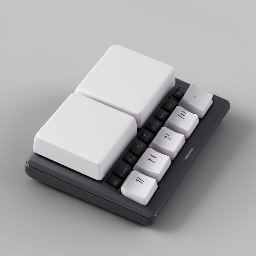

# DualKeyboard v4.0.1

## About

DualKeyboard is a small utility to allow the use of modifier keys "across" external keyboards in OS X. This is useful for people who want to use multiple external keyboards in a split-keyboard arrangement, or because they use a foot pedal or other assistive device.

DualKeyboard is **not mine.** It was written by [Chance Miller](http://dotdotcomorg.net/dual). [Phillip Calvin](https://github.com/pnc/dual-keyboards) preserved it on GitHub. 

I used Claude/Other models to customize and improve it for replacing Karabiner Elements/Kanata for simple dual keyboard use, vim style navigation, KeyCastr style key display for keyboard testing. 

*This replaces capslock to emit special character and remap special character because dealing with capslock state was inconsistent. So it might not work, or you need need to customize for your system.*

## Disclaimer

This project is untested and requires prior coding knowledge to use and modify. The authors and contributors are not responsible for any damages or issues that may arise from using this software. Use it at your own risk. This project also includes untested AI-generated code.

## Features

- Cross-keyboard modifier keys (Control, Shift, Command, Option)
- Vim-style navigation mode using CapsLock as modifier key
  - Tap CapsLock for Escape
  - Hold CapsLock and use h,j,k,l for arrow keys
  - Additional navigation keys: i (Page Up), o (Page Down), , (Home), . (End)
  - Lock navigation mode with Capslock + n or Escape + 1
- Single instance enforcement to prevent conflicts
- Exit key combination: Escape + Control + Space
- Restart key combination: Escape + 0; when eventually keyboard starts misbehave/lockup

### New in latest versions

- Check current mode in menu icon
- Status display in terminal, menubar showing current mode (Insert/Navigation)
- Display GUI Key Display with Escape + =  to show modifiers and keys much like xev
- Use Debug window with Escape + - (minus) for detailed view

## Usage 

You need to create ```dual-codesign-cert``` for signing follow [this](https://github.com/nikitabobko/AeroSpace/blob/main/dev-docs/development.md#2-create-codesign-certificate) and create similar one for DualKeyboard.

```
make clean && make && ./build.sh
```
This will result in Dual.app which you can use to run, you need to give assistive application permission in macos.  

#### Accessibility Permission
Grant permissions in System Settings > Privacy & Security > Accessibility

#### Startup
Add to System Settings > General > Login Items
to start automatically. 


## Usage Prior to v2.0.0

To use, simply compile using `Makefile` and then run `./bin/dual`. You may need to check "Enable access for assistive devices" in the Universal Access preference pane if you haven't done so already.

```
make
./bin/dual [OPTIONS]
```

Available options:
- `-d, --debug`: Enable debug mode with detailed logging
- `-q, --quiet`: Quiet mode, suppress non-error output
- `-v, --version`: Show version information
- `-h, --help`: Show help message


## Keyboard Shortcuts

- **Escape + Control + Space**: Exit the program
- **Escape + 0**: Restart the program (exit and launch again)
- **Escape + -**: Toggle debug messages (only when debug mode is active and quiet mode is not enabled) (quiet mode is default in latest versions no -q flag as well)
- **Escape + +**: Toggle **Key Display**  (v4.0.0)
- **CapsLock (tap)**: Send Escape key
- **CapsLock (hold) + h/j/k/l**: Arrow keys (left/down/up/right)
- **CapsLock (hold) + i/o**: Page Up/Page Down
- **CapsLock (hold) + ,/.**: Home/End
- **Escape + 1** or **CapsLock + n**: Lock vim navigation mode
- **Escape** or **CapsLock** or **Shift + I**: Exit vim navigation mode

## Status Display

The program shows the current state in the terminal when you start with -d or --debug:
- Shows current mode (I for Insert, N for Navigation)
- Displays mode changes in real-time
- Shows debug messages when enabled (can be toggled with Escape + -)
- Can be disabled with `-q` flag for background operation, in recent versions quiet mode is default
- Current .app version can show debug output in GUI Window 
- Key Display which shows you current keyboard presses in small window much like KeyCastr
- Debug and Key Display can be used much like xev in linux for debugging keyboard output

## Emergency Restore

If the program crashes or terminates unexpectedly, your CapsLock key might remain remapped. To restore the original CapsLock functionality, run the included shell script:

```
./restore-capslock.sh
```

This script will:
1. Restore the original CapsLock functionality
2. Remove any lock files left by the program
3. Allow you to restart the program if desired
